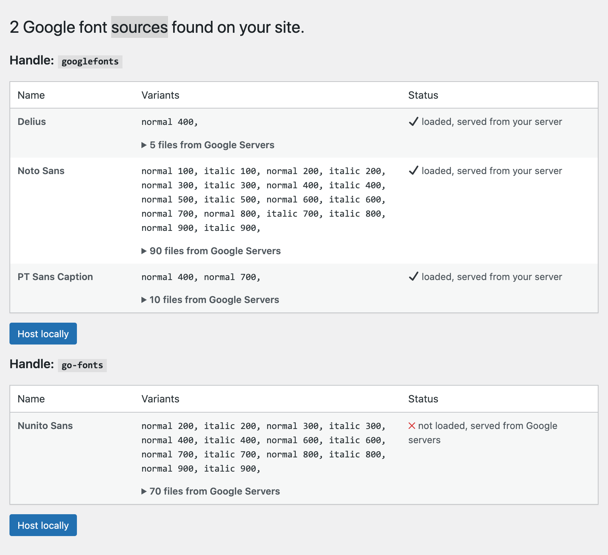
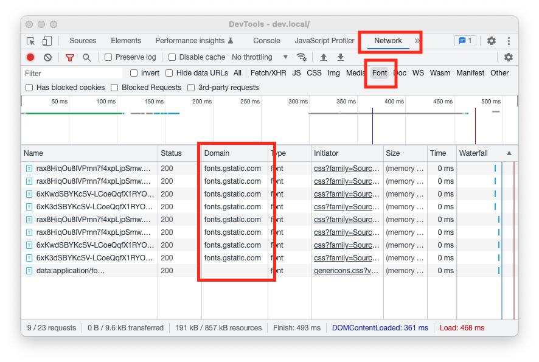

# Local Google Fonts

Contributors: everpress, xaverb  
Tags: googlefonts, google, fonts, gdpr, lgf, font, speed  
Requires at least: 4.6  
Tested up to: 6.2  
Stable tag: 0.21.0  
Requires PHP: 5.6+  
License: GPLv2 or later  
Donate link: https://evp.to/donate

## Description

Host your used Google fonts on your server and make your site more GDPR compliant 💯.

About 50 mio[\*](https://trends.builtwith.com/websitelist/Google-Font-API) sites use Google Fonts and in January 2022 a German court has ruled that using Google Fonts is a violation of Europe’s GDPR (General Data Protection Regulation).

more on [wptavern.com](https://wptavern.com/german-court-fines-website-owner-for-violating-the-gdpr-by-using-google-hosted-fonts)

## Screenshots

### 1. Option Interface.

### 2. Access development tools in your browser

### Features

### 1. Quick install (activate, setup and forget)

### 2. Automatically loads all used fonts to your server (wp-content/uploads)

### 3. Cleanup on plugin deactivation

### 4. Cleanup on plugin switch

## Installation

1. Upload the entire `local-google-fonts` folder to the `/wp-content/plugins/` directory
2. Activate the plugin through the 'Plugins' menu in WordPress
3. Go to Settings => Google Fonts and decide which fonts should get loaded locally

## Frequently Asked Questions

### Will this load Google Fonts automatically?

Yes, if you check the option to load fonts automatically. Otherwise each font set must be manually triggered.

### Is it Legal to Self-Host Google Fonts?

Yes. The open source fonts from Google Fonts are published under a licenses that allow you to use them on any website, no matter if it’s commercial or personal.

### How to check if my site is loading Google Fonts?

It's easy to check if your site is loading fonts from a third party source (check [2nd screenshot](https://wordpress.org/plugins/local-google-fonts/#screenshots) above):

1. Open the dev tools (Cmd + Opt + I on Mac or F12, or Ctrl + Shift + I on Windows)
2. Go to the **Network** tab and select the **Fonts** type
3. Reload your page to see all fonts loaded on your site.
4. Check the **Domain** column if it contains domains from a third party (Google is fonts.gstatic.com)

If you host your fonts locally with [Local Google Fonts](https://wordpress.org/plugins/local-google-fonts/) there should be no fonts loaded from the Google servers.

### My fonts do not show up on the settings page, what can I do?

Fonts are discovered once they are used. Try to browse your front end first and get back to the settings page.

### My fonts are not replaced, what can I do?

The plugin currently only checks fonts embedded via [`wp_enqueue_style`](https://developer.wordpress.org/reference/functions/wp_enqueue_style/) if you use Google fonts via `@import` you have to change that first.

### The Divi theme still loads a Google font?

The DIVI theme has a custom implementation of Google Fonts. To use LGF with DIVI disable _Improve Google Fonts Loading_ on the Performance Settings page of DIVI.

### Why only the woff2 font format is loaded?

Woff2 is the successor of the woff format and and offers a 30% average compression gain over the original format. It is also supported by over 96% of browsers ([source](https://caniuse.com/woff2)).

### How to host Fonts loaded with Slider Revolution?

Slider Revolution uses it's own way to load Google Fonts and LGF cannot handle them. Slider Revolution has a built in feature for their sliders.

1. Goto Slider Revolution
2. Click on "Global" in the top navigation
3. Find the "Fonts" section and Choose "Cache Fonts Local" on "Enable Google Fonts download"
4. Save your settings.

### Why are some characters displayed in the fallback font?

You may have loaded a subset which doesn't included required characters. Check additional subsets on the settings page and reload your font.

## Changelog

### 0.21.0

- fixed: issue downloading fonts with WordPress 6.2 caused by the `download_url` method

### 0.20.0

- make sure files are loaded via https if requested
- new filter `lgf_folder_url`and `lgf_folder`
- always append timestamp to prevent caching

### 0.19

- please reload fonts manually if you encounter problems after the update
- completely rewriting the way fonts are loaded which to drop the need for a third party API and support more (deprecated) fonts.
- better support for multi site (thanks @ravanh)
- the original style sheet is used for better compatibility
- added Settings link on the plugins list page
- added button to manually fetch homepage for used fonts
- only woff2 fonts are now loaded for better subset support
- removed unused seed variable

### 0.18

- do not use `remove_query_arg` to strip args as it can break some URLs

### 0.17

- remove `ver` query argument from URLs as they are added by WordPress. _Please review settings as fonts may have to be reloaded_
- introduced upgrade class for future updates
- added: welcome message after plugin activation
- added Codeable banner
- fixed: PHP warning on missing key

### 0.16

- using absolute path to support Google Fonts in [Mailster](https://mailster.co/?utm_campaign=wporg&utm_source=wordpress.org&utm_medium=readme&utm_term=Local+Google+Fonts).

### 0.15

- using custom mirror to prevent down times

### 0.14

- added info if https://google-webfonts-helper.herokuapp.com/ is down

### 0.13

- improved: better explanations on errors.
- improved: Higher propriety for wp_resource_hints to catch them all. Fixes #8
- implemented an alias method for no longer supported fonts.
- fixed: Syntax error on older PHP versions

### 0.12

- Do not handle fonts sources with more than 30 families (why would you need that?)
- Add option to choose subsets for each font family
- Disable functionality in the customizer

### 0.11

- fixed: problem on customizer in Neve theme
- fixed wrong domain on translations
- update F.A.Q. for DIVI theme

### 0.10

- fixed: rending issue on some fonts (please reload fonts if you use one of these: "exo-2", "inter", "jost" or "montserrat")
- fixed: some styles are not recognized and therefore not loaded.
- improved: info about loaded font files on the admin screen
- added timestamp to loaded font files to prevent cached fonts get loaded.

### 0.9

- new: options to load fonts automatically

### 0.8

- updated required WP version to 4.6
- remove Text Domain header
- added missing translatable strings

### 0.7

- better handling of multiple "family" arguments in the URL

### 0.6

- loading all variants if none explicit are requested
- cache API requests
- respect font-display
- removes DNS prefetch and preconnect to Google server from page header

### 0.5

- added option to flush everything

### 0.4

- you may have to reload fonts so please check the settings page
- improved handling of fonts
- only loading required font files
- supports now different types of variant declarations
- add variants to list only if available in the source
- added some css to improve settings page
- you may have to reload fonts so please check the settings page

### 0.3

- add explanation info on settings page

### 0.2

- show info when no font is found
- better handling of translated strings

### 0.1

- initial release
