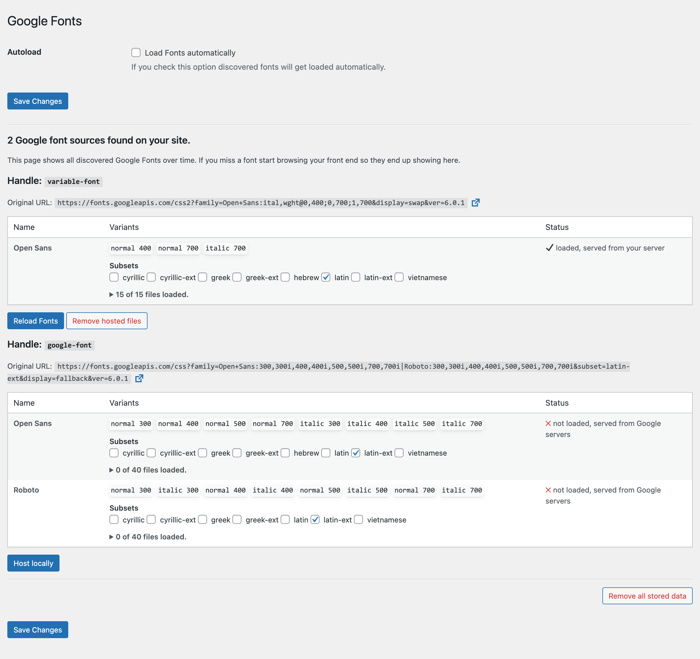

# Local Google Fonts

Contributors: everpress, xaverb
Tags: googlefonts, google, fonts, gdpr, lgf, font, speed
Requires at least: 4.6  
Tested up to: 6.0  
Stable tag: 0.10
Requires PHP: 5.6+  
License: GPLv2 or later  
Author: EverPress  
Author URI: https://everpress.co

## Description

Host your used Google fonts on your server and make your site more GDPR compliant 💯.

About 50 mio[\*](https://trends.builtwith.com/websitelist/Google-Font-API) sites use Google Fonts and in January 2022 a German court has ruled that using Google Fonts is a violation of Europe’s GDPR (General Data Protection Regulation).

more on [wptavern.com](https://wptavern.com/german-court-fines-website-owner-for-violating-the-gdpr-by-using-google-hosted-fonts)

## Screenshots

### 1. Option Interface.

### Features

### 1. Quick install (activate, setup and forget)

### 2. Automatically loads all used fonts to your server (wp-content/uploads)

### 3. Cleanup on plugin deactivation

### 4. Cleanup on plugin switch

## Installation

1. Upload the entire `local-google-fonts` folder to the `/wp-content/plugins/` directory
2. Activate the plugin through the 'Plugins' menu in WordPress
3. Go to Settings => Google Fonts and decide which fonts should get loaded locally

## Frequently Asked Questions

### Will this load Google Fonts automatically?

Yes, if you check the option to load fonts automatically. Otherwise each font set must be manually triggered.

### Is it Legal to Self-Host Google Fonts?

Yes. The open source fonts from Google Fonts are published under a licenses that allow you to use them on any website, no matter if it’s commercial or personal.

### My fonts do not show up on the settings page, what can I do?

Fonts are discovered once they are used. Try to browse your front end first and get back to the settings page.

### My fonts are not replaced, what can I do?

The plugin currently only checks fonts embedded via [`wp_enqueue_style`](https://developer.wordpress.org/reference/functions/wp_enqueue_style/) if you use Google fonts via `@import` you have to change that first.

### The Divi theme still loads a Google font?

The Divi theme has a custom implementation of Google Fonts. To use LGF with Divi disable _Improve Google Fonts Loading_ on the Performance Settings page of Divi.

## Changelog

### 0.10

-   fixed: rending issue on some fonts (please reload fonts if you use one of these: "exo-2", "inter", "jost" or "montserrat")
-   fixed: some styles are not recognized and therefore not loaded.
-   improved: info about loaded font files on the admin screen
-   added timestamp to loaded font files to prevent cached fonts get loaded.

### 0.9

-   new: options to load fonts automatically

### 0.8

-   updated required WP version to 4.6
-   remove Text Domain header
-   added missing translatable strings

### 0.7

-   better handling of multiple "family" arguments in the URL

### 0.6

-   loading all variants if none explicit are requested
-   cache API requests
-   respect font-display
-   removes DNS prefetch and preconnect to Google server from page header

### 0.5

-   added option to flush everything

### 0.4

-   you may have to reload fonts so please check the settings page
-   improved handling of fonts
-   only loading required font files
-   supports now different types of variant declarations
-   add variants to list only if available in the source
-   added some css to improve settings page
-   you may have to reload fonts so please check the settings page

### 0.3

-   add explanation info on settings page

### 0.2

-   show info when no font is found
-   better handling of translated strings

### 0.1

-   initial release
